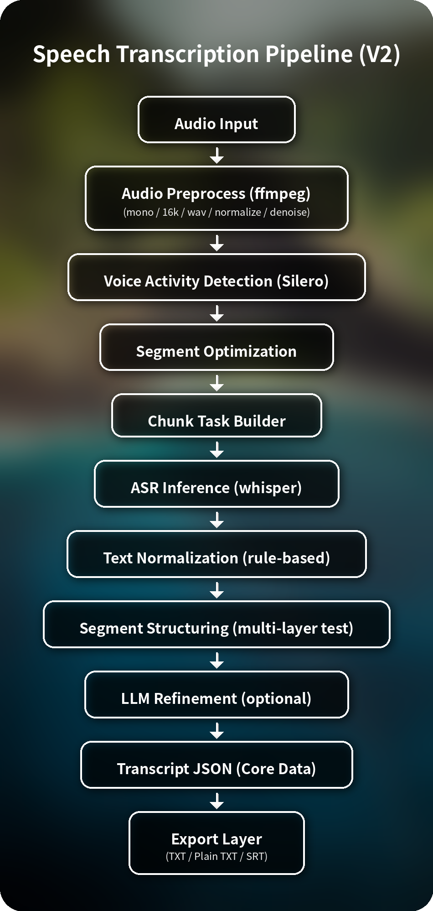
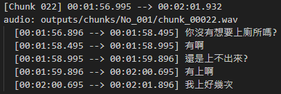
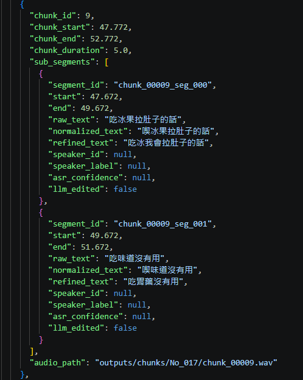
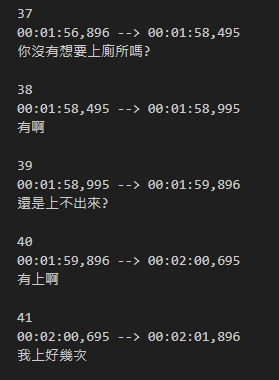

# Speech Transcription Pipeline（V2 - Structured ASR + LLM Refine）

一個以 Python 建立的語音轉錄處理流程（pipeline）  
目前版本為 **結構化 ASR pipeline（V2）**  
支援 JSON schema、多格式輸出（TXT / SRT）   
並新增 **LLM-based transcript refinement 模組**  

---

## V3版本線上 Demo

可以直接體驗語音轉文字功能：

https://neurons33-audio-demo.hf.space/

查看 Demo 原始碼：

https://github.com/Neurons-33/audio-demo

---

###  網頁介面

<p align="center">
  
</p>

---
### Demo 目前功能
* 🎵 音檔上傳介面
* 🧾 字幕（SRT）生成邏輯
* 🖥️ 前端即時預覽
* ☁️ Hugging Face 雲端部署
* 🔌 Supabase 環境變數整合
---

## 問題背景

現有 ASR 模型在長音檔或口語語音中，  
仍可能出現錯字、語意不完整或句子斷裂的問題。

因此本系統引入一層 LLM refinement 作為後處理機制，  
用於提升語意正確性與文本可讀性，  
並維持原始語音結構與時間對齊資訊。

---

## 專案狀態

-  V1：CPU baseline（已完成）
-  V1.1：結構化輸出 + SRT（已完成）
-  V2：LLM 轉錄修正（已完成）
-  V3：UI + FastAPI + Docker（已完成）
-  V4：說話者分離（diarization）

---

## 專案目標

建立一套模組化語音處理系統，包含：

- 音訊前處理與格式標準化
- 語音活動偵測（VAD）
- 音訊切段（chunk）
- 語音轉文字（ASR）
- 多格式輸出（JSON / TXT / SRT）
- LLM-based transcript refinement
- 可延伸支援 GPU / diarization / API

並作為後續部署與多模型整合的基礎。

---

## 目前功能（V2）Demo 僅作為UI展示

### 已完成

- 支援 `.m4a / .wav` 音檔輸入
- 音訊前處理（mono / 16k / wav）
- VAD 語音偵測 (Silero)
- chunk 切段與時間對齊
- CPU 平行 ASR (faster-whisper)
- 繁體中文轉換 （OpenCC）
- 結構化 JSON 輸出（file-level schema）
- TXT / Plain TXT / JSON / SRT 多格式輸出
- **LLM 轉錄修正（可選）**
  - minimal：僅修正 ASR 錯字，保留原始口語結構（低成本）
  - readable：提升語句流暢度與可讀性（較高成本）

---

## LLM Refinement 模組（V2 核心升級）

本專案引入一層可控成本的 LLM refinement system，  
用於修正 ASR 誤差並提升文本可讀性，  
同時透過 windowing 與 schema validation 控制 token 成本與輸出穩定性。 

### 模組組成

```text
services/llm_refine/
├─ client.py           # LLM API 呼叫
├─ orchestrator.py     # refinement 流程控制
├─ prompt_builder.py   # prompt 組裝
├─ schema.py           # 輸出格式定義
├─ validator.py        # 回應驗證
└─ windowing.py        # 長文本切分策略
```

## 設計特點

- 保留原始 ASR 結構（不覆蓋 raw text）
- 採用 window-based processing 控制 LLM 輸入長度，避免長音檔造成 token 爆炸
- 嚴格 schema 驗證，避免 hallucination
- 可控制修正強度（minimal / readable）

---

## 輸出格式說明

本專案輸出四種逐字稿格式：

### 1 `.json`（核心資料）

- 結構化語音資料（file → chunk → segment）
- 保留時間戳與 metadata
- 支援未來：
  - speaker diarization
  - LLM refinement
  - embedding / search

 **建議作為主資料來源**

---

### 2 `.txt`（帶時間戳）

- chunk + segment 可讀格式
- 適合 debug / trace

---

### 3 `_plain.txt`

- 純文字拼接
- 適合快速閱讀

---

### 4 `.srt`（字幕）

- 可直接用於影片 / 播放器
- 支援時間對齊

---

## 專案結構

```text
.
├─ data/
│   └─ sample.m4a               # 測試音檔
│
├─ models/
│   ├─ vad_model.py             # VAD模型載入 / 管理
│   └─ whisper_model.py         # Whisper模型載入 / 管理
│
├─ outputs/
│   ├─ audio/                   # 預處理後音訊
│   ├─ chunks/                  # 切段結果
│   └─ transcripts/             # JSON source + TXT / SRT views
│
├─ pipeline/
│   ├─ asr.py                   # chunk切分、ASR轉錄與文字過濾
│   ├─ audio_preprocess.py      # 音訊前處理(mono / 16k / normalize / denoise)
│   ├─ runner.py                # pipeline主流程協調與輸出管理
│   └─ vad.py                   # VAD語音偵測
│
├─ services/
│  └─ llm_refine/               # LLM transcript refinement（V2）
│     ├─ client.py              # LLM API呼叫
│     ├─ orchestrator.py        # refinement流程控制
│     ├─ prompt_builder.py      # prompt組裝
│     ├─ schema.py              # refinement輸出格式定義
│     ├─ validator.py           # LLM回應驗證
│     └─ windowing.py           # 長文本切分策略
│
├─ scripts/
│   └─ test_pipeline.py         # CLI測試入口
│
├─ tests/
│  ├─ fixtures/
│  │  └─ llm_refine_segments.py # refine測試資料
│  ├─ integration/
│  │  └─ test_pipeline_e2e.py   # pipeline整合測試
│  └─ unit/
│     ├─ llm_refine/
│     │  ├─ test_client_mock.py
│     │  ├─ test_orchestrator.py
│     │  ├─ test_prompt_builder.py
│     │  ├─ test_schema.py
│     │  ├─ test_validator.py
│     │  └─ test_windowing.py
│     └─ __init__.py
│
├─ utils/
│   ├─ audio_utils.py           # ffmpeg / audio處理
│   ├─ file_utils.py            # File I/O / 路徑 / 儲存
│   ├─ text_utils.py            # 基礎文字清理與正規化（rule-based）
│   └─ srt_utils.py             # 字幕格式生成
│
├─ requirements.txt
└─ requirements.lock

```
---

## 輸出範例

### pipeline

<p align="center">
  
</p>

本 pipeline 採用 **data-centric design**：

- 每個階段皆為資料轉換（audio → segments → structured transcript）
- JSON 為核心資料來源（source of truth）
- TXT / SRT 為輸出視圖（views）

### TXT 逐字稿

<p align="center">
  
</p>

### JSON 結構

<p align="center">
  
</p>

### Text Processing Layers

每個 segment 保留多層文字處理結果：

- `raw_text`：ASR 原始輸出
- `normalized_text`：規則化處理後文字（去除雜訊、標點修正）
- `refined_text`：LLM 修正後結果（可選）

此設計為非覆蓋式（non-destructive），  
確保原始資料不被修改，並可進行多層比較與分析。  

refined_text 僅在啟用 LLM refinement 時更新，  
否則維持與 normalized_text 相同。

並透過 `llm_edited` 欄位標記該 segment 是否經過 LLM 修正，  
方便進行分析、debug 與品質評估。

### SRT 結構

<p align="center">
  
</p>

---

## 執行環境

Python 3.11（建議）

CPU 執行（目前未使用 GPU）

---

## 基本執行

```bash
python -m scripts.test_pipeline --input data/sample.m4a
```
---

## 啟用LLM修正

```bash
python -m scripts.test_pipeline \
  --input data/sample.m4a \
  --refine_mode readable
```

---

## 進階參數

```bash
python -m scripts.test_pipeline \
  --input data/sample.m4a \
  --workers 4 \
  --beam_size 3 \
  --whisper_size medium \
  --min_duration 0.6 \
  --merge_gap 0.35 \
  --pad 0.1 \
  --refine_mode minimal
```

---

## 參數說明

| 參數 | 說明 |
|------|------|
| `--input` | 輸入音檔路徑 |
| `--workers` | CPU 平行處理數量 |
| `--beam_size` | beam search 大小（越大越準但越慢） |
| `--whisper_size` | 模型大小（base / small / medium） |
| `--min_duration` | 最小語音片段長度（秒） |
| `--merge_gap` | 片段合併間隔（秒） |
| `--pad` | 每段音訊前後 padding（秒） |
| `--refine_mode` | LLM 修正模式（off / minimal / readable） |

---

## 目前限制 (V2)

- 僅支援 CPU（速度有限）
- LLM refine 會增加 latency 與 token cost
- 長音檔需進行 window 切分（非即時）
- 尚未支援 GPU 自動切換
- 尚未支援說話者分離
- 尚未部署 FastAPI / Web

---

## 後續規劃

- GPU 自動偵測與加速
- FastAPI API（short / long 模式分流）
- chunk 策略優化（動態切分）
- speaker diarization（說話者辨識）
- LLM refine 成本優化（token 控制）
- 非同步任務（長音檔處理）

